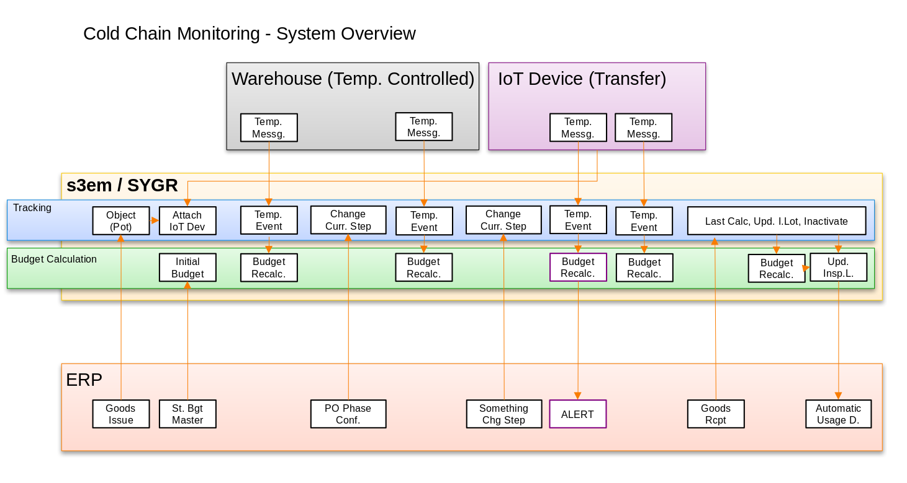
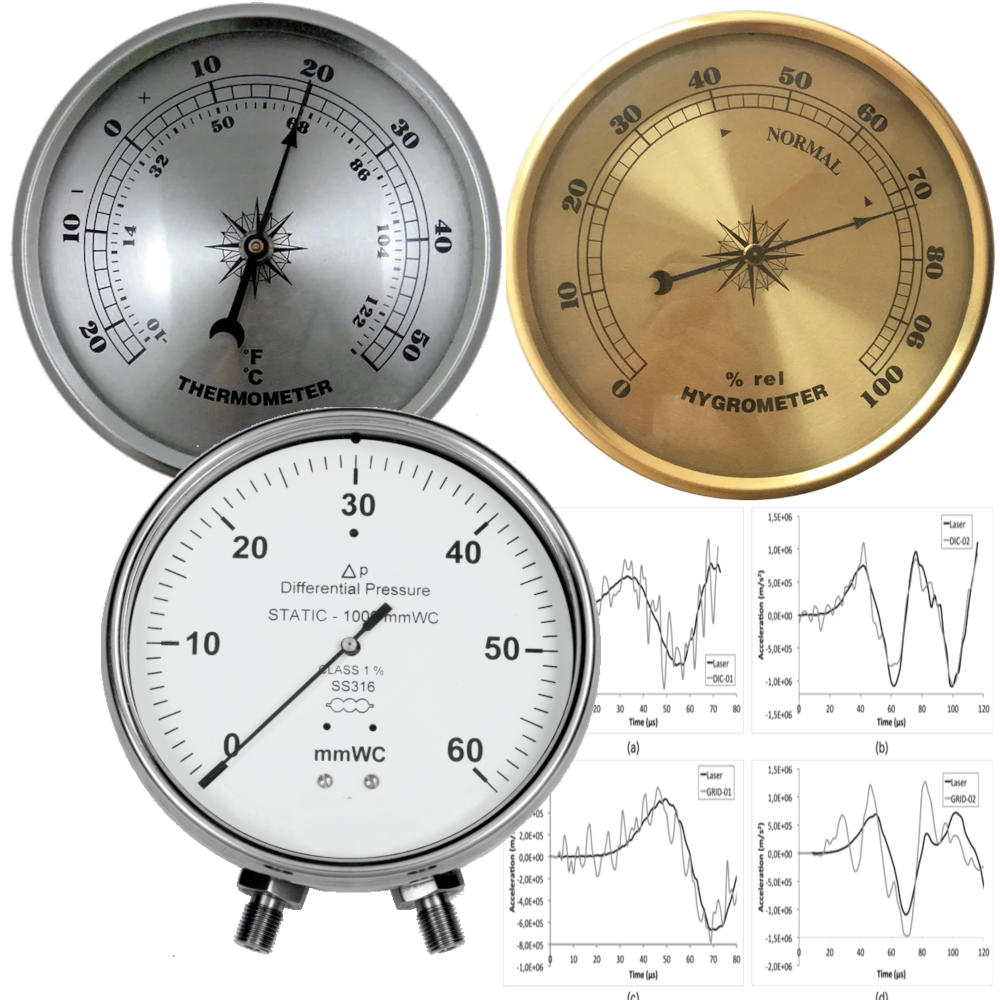
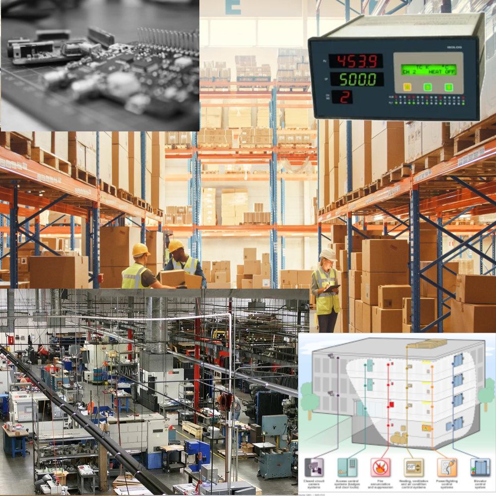
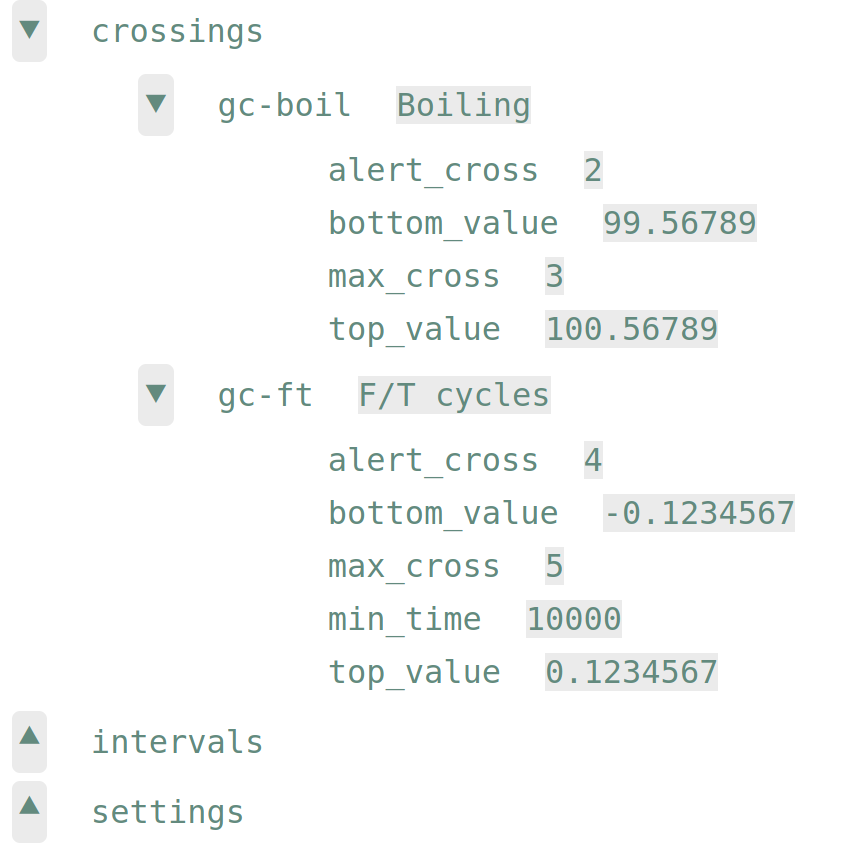
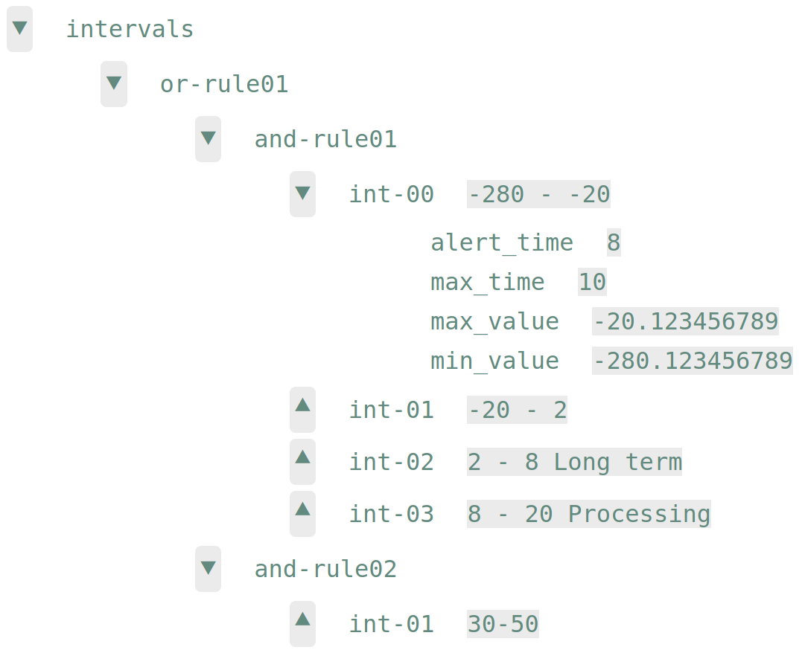
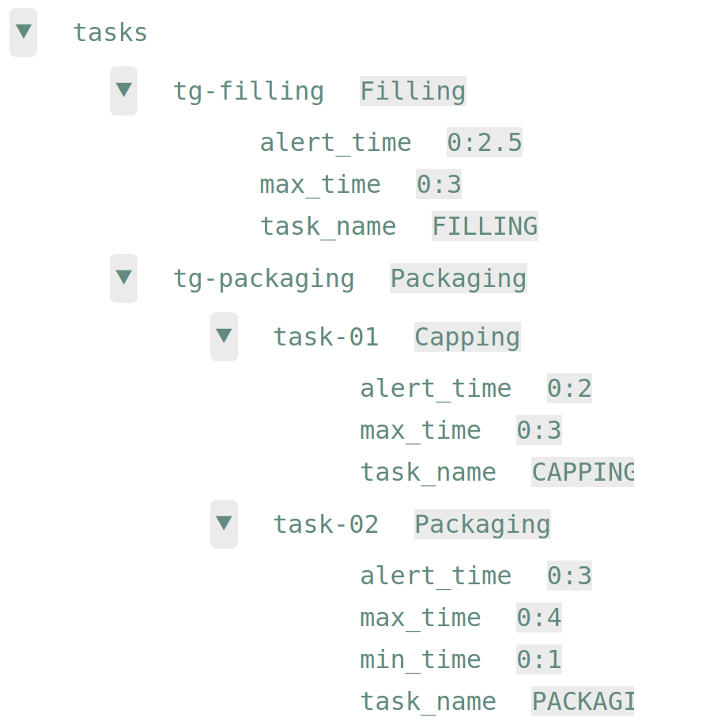
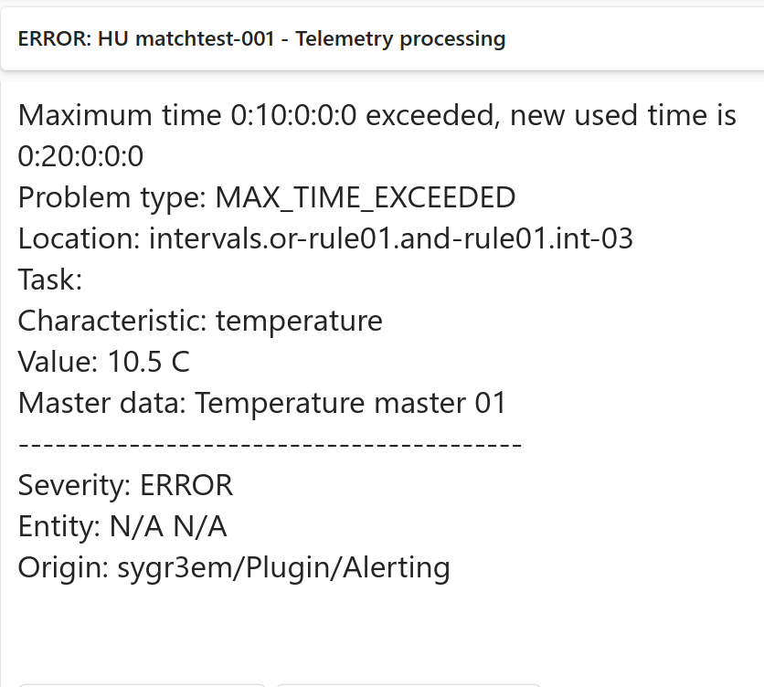
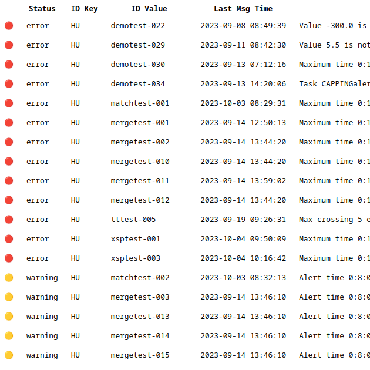
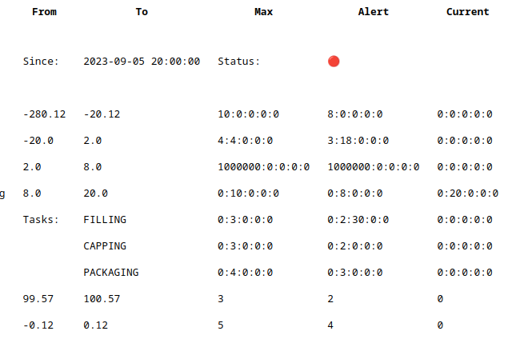

# The SYGR End to End Environment Monitoring

SYGR End to End Environment monitoring is an add-on for the [SYGR Automation System](https://www.sygr.ch/).

It was designed and created according to the environment (temperature, etc.) monitoring requirements of the World's leading pharmaceutical companies.

It can cover (e.g.) the complete Cold Chain Processing like

## Measure and trace any number and any kind of environmental characteristics, like
- Temperature
- Humidity
- Pressure
- Acceleration

## Receive measurements from different sources
- Data Loggers
- IoT Devices
- Warehouse Managements Systems
- Manufacturing Execution Systems
- Facility Control Systems

## Define complex Stability Budget Master Data with 
- threshold crossing limits
- compex Interval Allowances with Or - and And-rules
- Soft- and Hard Time Allocations to Processing Tasks

  

## Monitoring
In case of an error or warning situation receive automatic alert notifications and send messages to partner systems (e.g. to ERP to update Batch Usage Decision).

## Reporting
Run concise reports or very detailed ones

 

## Installation and Configuration

For the detailed instructions see [the E3M Homepage](https://www.sygr.ch/s3em/).